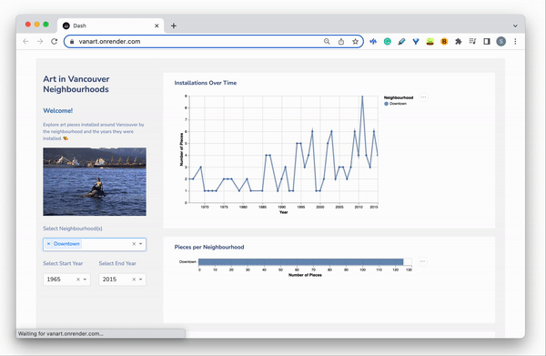

# VanArt: Exploring Art in Vancouver Neighbourhoods



Welcome! 

Visit the dashboard here: [vanart](https://vanart.onrender.com/) 🎨 

## Proposal 

Please see the proposal [here](https://github.com/UBC-MDS/VanArt/blob/main/reports/proposal.md).

## Usage 

**Dashboard Features** 

The goal of the dashboard is to help you explore art metrics in neighbourhoods around Vancouver. To do this, the dashboard displays a single page containing drop-down selectors, two graphs, and a data table. 
  
1. Filter Selectors (widgets) 🔽
    - All filter selection elements are displayed on the left panel of the page. 
    - You can firstly choose one or multiple neighbourhoods you wish to explore using the "Select Neighbourhood(s)" dropdown menu. 
      - For example, do you only want to see how many art pieces are installed in your neighbourhood Kitslano? 
    - You can also choose a start and end date, which correspond to a period of time when art pieces were installed. This is done using the "Select Start Year" and "Select End Year" dropdown menus. 
      - For example, do you only wish to see newer art pieces, installed between 2010-2022? 

2. Graphs and Table (reactive elements) 📈
    - Two reactive graphs are shown on the right panel. 
    - The first graph (different from shiny app) is a line plot of year and number of art pieces installed. **The information shown is the trend of how many art pieces were installed per year.** The lines are coloured by neighbourhood. 
      - From exploring, you may perhaps notice that more art pieces have been installed in recent years than in the past. 
    - The second graph shows a bar plot **comparing neighbourhoods and how many art pieces are installed in each one**. 
      - You can try selecting "Downtown" + some other neighbourhoods, and notice that Downtown has a lot of pieces installed! 
    - (**Please note: the y-axis of the second graph is 'Neighbourhoods', but the label was removed as a design choice to declutter the interface for a better user experience)

3. Data table 🧮
    - A data table (different from shiny app) is displayed on the right panel, under the two graphs. 
    - This table is reactive and **shows the exact data used to create the two graphs**. 
    - It also displays information about the title of the art pieces, what "type" they are (mural, statue, etc.), as well as an address in case you're interested in visiting it. 


## Replicate the Dashboard Locally 

Follow the steps below to run the dashboard locally on your own device: 

1. Clone the repository 

```
$ git clone git@github.com:shlrley/VanArt.git
```

2. Navigate to the repository's directory 

```
$ cd VanArt
```

3. Install the requirements listed in the [requirements.txt](https://github.com/shlrley/VanArt/blob/main/src/requirements.txt) file 

4. Run the command below 

```
$ python src/app.py
```

5. Copy the address in the output, for example: 

```
Dash is running on http://127.0.0.1:8050/
```

6. Paste the address in your browser (i.e Google Chrome)

## License 

The MIT license is used for this project, please find it [here](https://github.com/shlrley/VanArt/blob/main/LICENSE). 

## References 

Data for this dashboard was sourced from the [City of Vancouver Open Data Portal](https://opendata.vancouver.ca/explore/dataset/public-art/export/).
  
This dashboard was created by Shirley Zhang in fulfillment of requirements for the Masters of Data Science Program at the University of British Columbia. 
